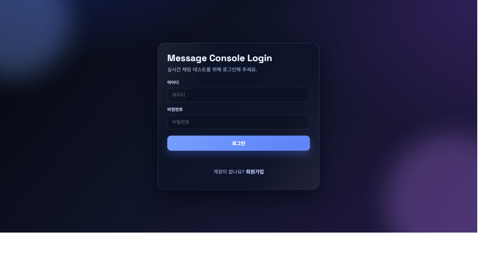
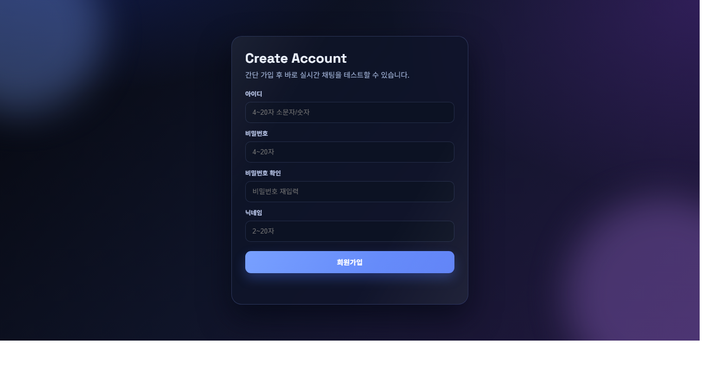
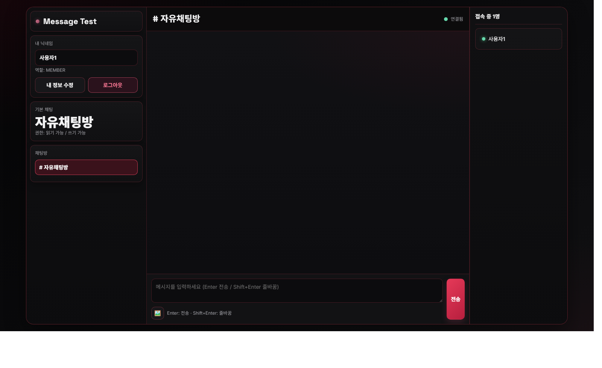
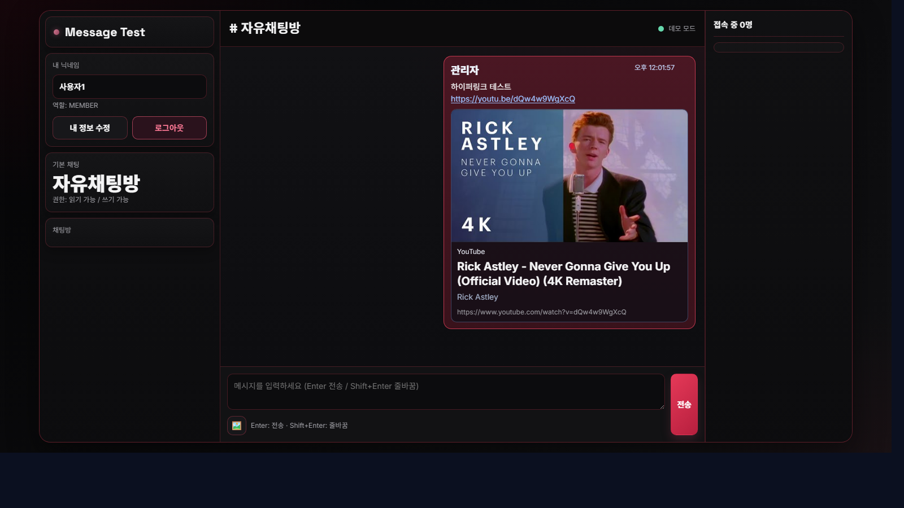
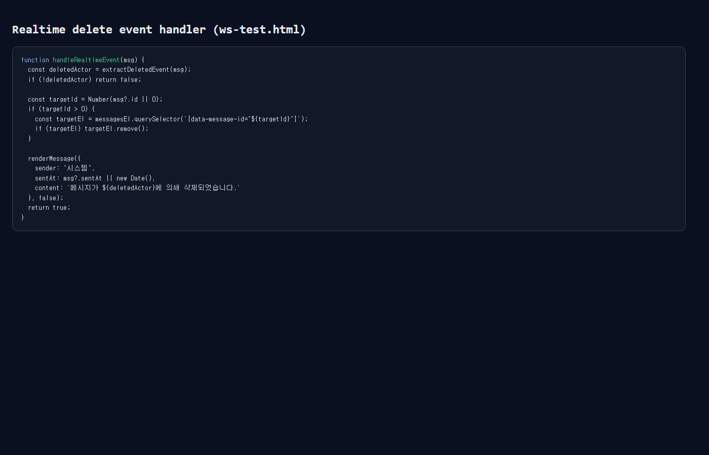

# message-test

실시간 채팅(WebSocket STOMP) + 인증/권한 관리 + 관리자 기능을 구현한 **Spring Boot 3 백엔드/웹 통합 프로젝트**입니다.

> Current Version: **v0.4.0**

---

## 1) 프로젝트 한 줄 소개

권한 기반 채널 접근 제어와 실시간 메시징을 결합해, 실제 협업 도구의 핵심 흐름(로그인 → 채널 입장 → 메시지 송수신 → 관리/통제)을 구현했습니다.

## 2) 데모

- 로컬 실행: `http://localhost:8080`
- 로그인: `http://localhost:8080/login.html`
- WebSocket 테스트: `http://localhost:8080/ws-test.html`
- 헬스체크: `http://localhost:8080/health`

> 배포 URL: 준비 중 (Render/Railway/AWS 중 1개로 배포 예정)

---

## 3) 기술 스택

- **Language**: Java 17
- **Framework**: Spring Boot 3.3.2
- **Realtime**: Spring WebSocket (STOMP + SockJS)
- **Persistence**: Spring JDBC, MySQL(prod) / H2(local)
- **Validation**: Bean Validation
- **Build**: Gradle 8.10.2
- **Test**: JUnit5, Spring MockMvc

---

## 4) 핵심 기능

### 인증/계정
- 회원가입 / 로그인 API
- 입력값 검증 및 표준 에러 응답

### 채팅
- WebSocket 기반 실시간 송수신 (`/pub`, `/sub`)
- 채널별 메시지 조회/수정/삭제
- 삭제 이벤트 실시간 반영

### 권한/관리자
- 역할 기반 접근 제어(ADMIN/MODERATOR/MEMBER/GUEST)
- 채널 생성/정렬/권한 설정
- 관리자 전용 API 분리

### 프론트 상호작용
- 링크 자동 인식
- YouTube 썸네일/제목 미리보기(oEmbed)
- Base64 이미지(`[img]data:image/...`) 렌더링

---

## 5) 시스템 구조

```text
Client (login.html / ws-test.html)
   ├─ REST: /api/auth, /api/channels, /api/admin
   └─ WS: /ws (STOMP)
            ├─ Publish: /pub/channels/{channelId}
            └─ Subscribe: /sub/channels/{channelId}

Spring Boot
   ├─ auth (인증/사용자)
   ├─ chat (메시지/채널/권한)
   ├─ common (ApiResponse, 예외 처리)
   └─ jdbc (schema.sql 기반 초기화)

Database
   ├─ users
   ├─ channels
   ├─ channel_permissions
   └─ messages
```

### 패키지 구성

```text
app/src/main/java/message
├─ auth/
│  ├─ AuthController.java
│  └─ AuthService.java
├─ chat/
│  ├─ ChatController.java
│  ├─ ChatService.java
│  ├─ ChatRepository.java
│  ├─ AccessControlService.java
│  └─ WebSocketConfig.java
└─ common/
   ├─ api/
   │  ├─ ApiResponse.java
   │  ├─ ApiErrorResponse.java
   │  └─ GlobalExceptionHandler.java
   └─ error/
      ├─ ErrorCode.java
      └─ ApiException.java
```

---

## 6) 실행 방법 (Windows)

```bash
gradlew.bat :app:bootRun
```

기본은 H2 인메모리 DB로 동작합니다.

MySQL 사용 시 환경변수 예시:

```bash
set DB_URL=jdbc:mysql://localhost:3306/message_test?serverTimezone=Asia/Seoul&characterEncoding=UTF-8
set DB_USER=root
set DB_PASSWORD=your_password
set DB_DRIVER=com.mysql.cj.jdbc.Driver
```

---

## 7) API 요약

### Auth
- `POST /api/auth/signup`
- `POST /api/auth/login`

### Chat
- `GET /api/channels`
- `GET /api/channels/{channelId}/messages?sender={name}&limit={n}`
- `GET /api/channels/{channelId}/online-users?sender={name}`
- `GET /api/access/{channelId}?sender={name}`
- `PUT /api/channels/{channelId}/messages/{messageId}?sender={name}`
- `DELETE /api/channels/{channelId}/messages/{messageId}?sender={name}`

### Admin
- `POST /api/admin/users/{sender}/role?actor={name}&role={ADMIN|MODERATOR|MEMBER|GUEST}`
- `POST /api/admin/channels?sender={name}&channelId={id}`
- `POST /api/admin/channels/reorder?sender={name}`
- `POST /api/admin/channels/{channelId}/permissions?role={...}&canRead={true|false}&canWrite={true|false}`

---

## 8) 응답 포맷 표준화

### Success

```json
{
  "timestamp": "2026-02-24T02:20:00Z",
  "success": true,
  "data": {}
}
```

### Error

```json
{
  "timestamp": "2026-02-24T02:20:00Z",
  "status": 403,
  "code": "FORBIDDEN",
  "message": "관리자만 수행할 수 있습니다",
  "details": []
}
```

---

## 9) 테스트

```bash
gradlew.bat clean test
```

현재 포함 테스트:
- `/health` 정상 응답 검증
- 회원가입 입력 검증 실패 케이스 검증
- 회원가입 → 로그인 성공 플로우 검증

---

## 10) 트러블슈팅 / 개선 기록

### [해결] `:app:bootJar` 실패 이슈
- 증상: Gradle 9.2.0 환경에서 `CopyProcessingSpec.getDirMode()` 관련 실패
- 조치: Gradle Wrapper를 8.10.2로 조정
- 결과: `clean test :app:bootJar` 정상 통과

### [정리] 초기 템플릿 잔재 제거
- `massege` 패키지(오타 포함) 및 `app/bin` 추적 산출물 제거
- `.gitignore` 보강으로 재발 방지

### 리팩토링 히스토리
- **1차**: WebSocket/메시지 수정·삭제 안정화, 링크 프리뷰, 삭제 이벤트 반영
- **2차**: `ErrorCode`/`ApiException` 도입, 예외 응답 정규화
- **3차**: `ChatRepository` 분리, `ApiResponse<T>` 점진 통일
- **4차**: DB 영구저장 전환(JDBC + schema), 시드 로직, 프로젝트 구조 정리

---

## 11) 스크린샷

### 로그인 화면


### 회원가입 화면


### 채팅 테스트 화면


### 하이퍼링크(YouTube 프리뷰) 테스트


### 실시간 삭제 처리 코드 캡처


---

## 12) 포트폴리오 관점에서의 강점

- 실시간 통신 + 권한 제어 + 예외 표준화까지 다룬 **실전형 주제 선정**
- 리팩토링 과정을 단계별로 축적한 **개선 중심 개발 흐름**
- DB 전환 및 빌드 이슈 해결 기록을 통한 **문제 해결 능력 증명**

## 13) 다음 개선 계획

- [ ] 외부 배포 URL 공개
- [ ] GitHub Actions 기반 CI(test) 구성
- [ ] 통합 테스트 시나리오 확장(권한/채널/관리자 플로우)
- [ ] 성능/부하 테스트 간단 지표 추가
