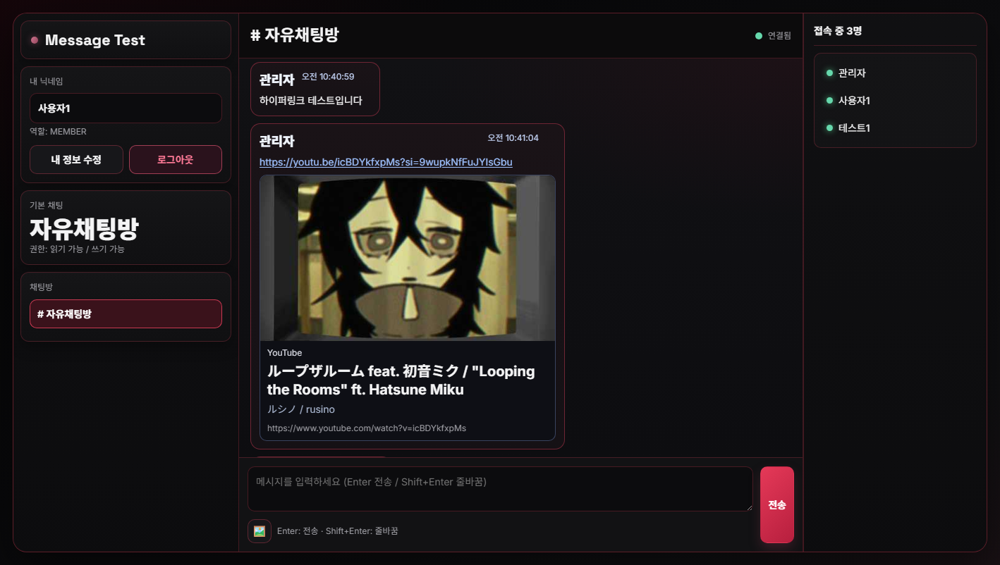

# message-test

실시간 채팅(WebSocket STOMP) + 인증/권한 관리 + 관리자 기능을 포함한 Spring Boot 3 기반 샘플 프로젝트입니다.

> Current Version: **v0.5.0**

## 1) 프로젝트 개요

`message-test`는 **실시간 메시징 + 권한 제어 + 운영 관리**를 함께 다루는 채팅 서비스 프로젝트입니다.

## 2) 기술 스택
- Java 17
- Spring Boot 3.3.2
- Spring Web / WebSocket (STOMP)
- Spring JDBC
- Bean Validation
- Spring Boot Actuator
- Micrometer Prometheus Registry
- Gradle (multi-module root + `app`)

## 3) 주요 기능
### Auth
- 회원가입 / 로그인

### Chat
- 채널 목록 조회
- 채널별 메시지 조회/전송
- 메시지 수정/삭제
- 삭제 이벤트 실시간 반영

### Access/Role
- 역할 기반 채널 읽기/쓰기 권한 제어
- 사용자 역할 변경(관리자)
- 채널 생성/순서 변경/권한 정책 설정

## 4) API 요약
### Auth
- `POST /api/auth/signup`
- `POST /api/auth/login`

### Chat
- `GET /api/channels`
- `GET /api/channels/{channelId}/messages?sender={name}&limit={n}`
- `GET /api/channels/{channelId}/online-users?sender={name}`
- `GET /api/access/{channelId}?sender={name}`
- `PUT /api/channels/{channelId}/messages/{messageId}?sender={name}`
- `DELETE /api/channels/{channelId}/messages/{messageId}?sender={name}`

### Admin
- `POST /api/admin/users/{sender}/role?actor={name}&role={ADMIN|MODERATOR|MEMBER|GUEST}`
- `POST /api/admin/channels?sender={name}&channelId={id}`
- `POST /api/admin/channels/reorder?sender={name}`
- `POST /api/admin/channels/{channelId}/permissions?role={...}&canRead={true|false}&canWrite={true|false}`

## 5) 실행
```bash
gradlew.bat :app:bootRun
```

기본 접속:
- App: `http://localhost:8080`
- Login: `http://localhost:8080/login.html`
- WS Test: `http://localhost:8080/ws-test.html`
- Health: `http://localhost:8080/health`

테스트:
```bash
gradlew.bat :app:test
```

## 6) Observability / Ops
- Health: `/actuator/health`
- Readiness/Liveness probes: enabled
- Prometheus metrics: `/actuator/prometheus`
- 운영 대응 가이드: `docs/runbook.md`
- ADR: `docs/adr/0001-session-auth-over-token.md`

## 7) Performance Smoke (k6)
```bash
k6 run perf/k6-smoke.js
```

## 8) Local Infra (MySQL + Redis)
```bash
docker compose -f docker-compose.infra.yml up -d
```

## 9) 실행 스크린샷

### 로그인 화면


### 회원가입 화면


### 채팅 테스트 화면


### 채팅 메인 화면


## 10) Engineering Standards
- CI: `.github/workflows/ci.yml`
- PR Template: `.github/pull_request_template.md`
- Code style baseline: `.editorconfig`
